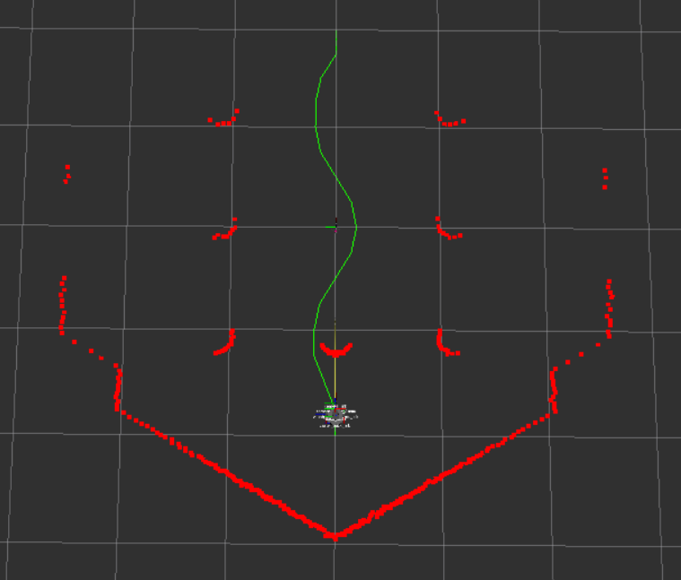
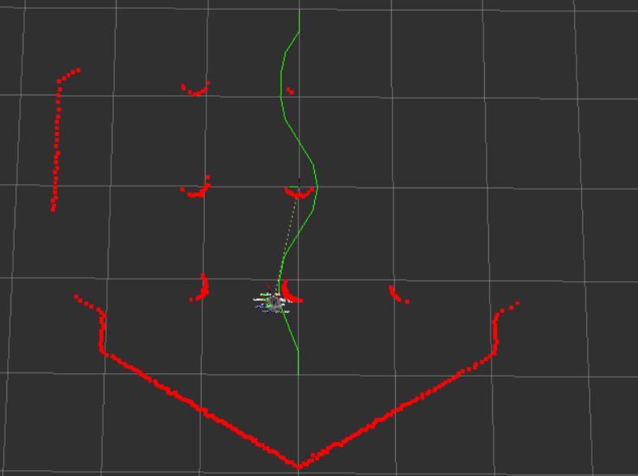
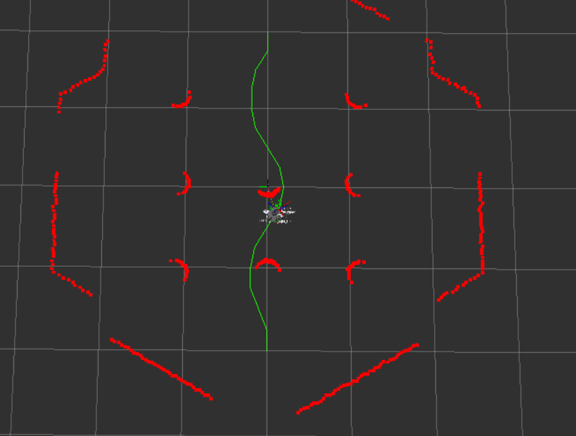
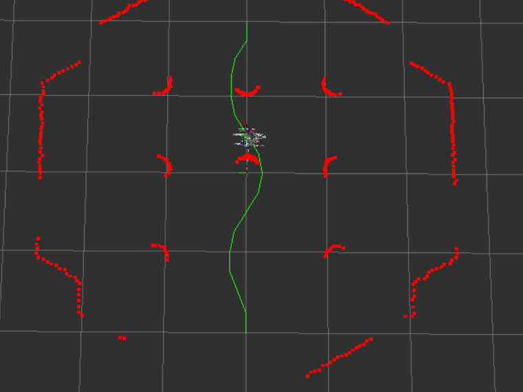

# Robotics Laboratory 🤖

[](http://wiki.ros.org/noetic)
[](https://www.python.org/)
[](https://www.docker.com/)
[](LICENSE)

This repository contains the materials and developments carried out for the **Robotics Laboratory** course in the 4th year of the Degree in Electronics, Robotics, and Mechatronics Engineering. The project ranges from autonomous navigation simulation with **Turtlebot 3** to the programming of **ABB** industrial robots.

---

## 📋 Table of Contents
- [Repository Structure](#-repository-structure)
- [Autonomous Navigation (Turtlebot 3)](#-autonomous-navigation-turtlebot-3)
  - [Usage Instructions](#usage-instructions)
  - [Development Process](#development-process)
  - [Results](#results)
- [Industrial Robotics (ABB)](#-industrial-robotics-abb)
- [Jupyter Notebooks](#-jupyter-notebooks)
- [Docker Configuration](#-docker-configuration)
- [Authors](#-authors)

---

## 📂 Repository Structure

The repository is organized as follows:

- `Simulation Exercises/`: ROS packages for reactive and autonomous navigation.
- `ABB Robots/`: RobotStudio stations and documentation of sessions with ABB robots.
- `Jupyter Notebooks/`: Practices and exercises on data processing and robotics.
- `docker/`: Configuration files to run the environment in containers.
- `media/`: Images and videos of the results obtained.

---

## 🐢 Autonomous Navigation (Turtlebot 3)

A controller has been designed for the Turtlebot 3 to follow a path while avoiding obstacles reactively.

### Usage Instructions

1. **Launch basic reactive navigation:**
   ```bash
   roslaunch autonomous_navigation challenge_reactive.launch
   ```

2. **Challenge Evaluation:**
   In separate terminals:
   ```bash
   roslaunch challenge_evaluation robotics_challenge_reactive.launch
   roslaunch challenge_evaluation evaluation_reactive.launch
   ```

### Development Process

1. **Subscription and Perception:** The script subscribes to `/move_base_simple/goal` for the target and `/scan` for the LiDAR.
2. **Proportional Controller:** The angle and distance to the target are calculated using coordinate transformations.
3. **LiDAR Optimization:** The FOV was limited to 90º at the front to avoid infinite loops when detecting side obstacles.
4. **Path Navigation:** The robot follows a list of points published by `path_publisher.py`, updating the goal upon reaching each point.
5. **Advanced Evasion:** A "wall-following" or "bordering" logic was implemented to navigate around large walls more efficiently.

### Results

| Scenario 1 | Scenario 2 |
|:---:|:---:|
|  |  |
|  |  |

📺 **Final Challenge Video:** [Turtlebot 3 Challenge Evaluation](https://youtu.be/jFht1mxALfw)

---

## 🦾 Industrial Robotics (ABB)

During laboratory sessions, work was done with RobotStudio stations:
- **Welding Simulation:** Definition of tools and paths at v10 (10 mm/s) for welding processes.
- **Tool Design:** Creation of physical models for end-effectors integrated into the simulation environment for object handling.

---

## 📓 Jupyter Notebooks

The repository includes notebooks with fundamental practices:
- Sensor data processing.
- Implementation of localization algorithms.
- Kinematics and control exercises.

---

## 🐳 Docker Configuration

To facilitate environment deployment without complex local installations:

1. **Windows:** Run `run_container_windows.bat` and open **Xming** for visualization.
2. **Additional Terminal:**
   ```bash
   docker exec -it lab_rob_container bash
   ```
3. **Useful Commands:**
   - Start Gazebo: `roslaunch turtlebot3_gazebo turtlebot3_empty_world.launch`
   - Teleop: `roslaunch turtlebot3_teleop turtlebot3_teleop_key.launch`

---

## ✍️ Authors

- **Fernando Román Hidalgo**
- **José Chaqués Torres**


